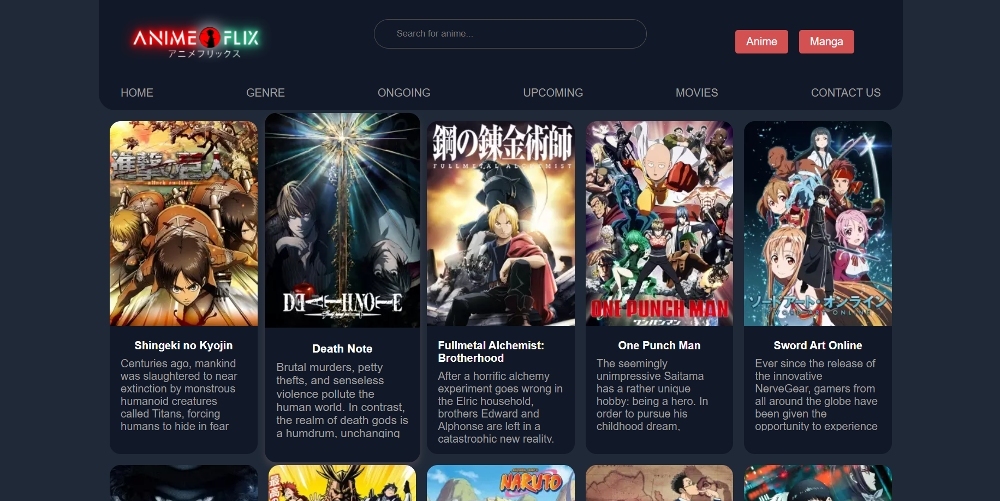

# AnimeFlix

AnimeFlix is a website where you can explore information about anime and manga, watch trailers, and discover streaming platforms to enjoy your favorite shows.

## Features

- Browse top anime and manga.
- Search for specific titles.
- View detailed information about each anime, including synopsis, ratings, producers, studios, genres, and more.
- Watch trailers and find streaming platforms.
- Responsive design for seamless viewing on various devices.

## Technologies Used

- HTML
- CSS
- JavaScript
- Fetch API for data retrieval
- Jikan API for anime and manga information

## Usage or Cloning

To run the website locally, follow these steps:

1. Clone the repository:
   ```bash
   git clone https://github.com/chinxcode/animeflix.git
   ```

2. Navigate to the project directory:
   ```bash
   cd animeflix
   ```

3. Open the `index.html` file in your web browser or serve it using a local server.

## Screenshots




## Contributions

Contributions are welcome! If you find any issues or have suggestions for improvements, feel free to open an issue or create a pull request.

## License

This project is licensed under the [MIT License](LICENSE).


## Disclaimer

This website is for educational and entertainment purposes only. While we strive to provide accurate and up-to-date information, we make no representations or warranties of any kind, express or implied, about the completeness, accuracy, reliability, suitability, or availability with respect to the website or the information, products, services, or related graphics contained on the website for any purpose. Any reliance you place on such information is therefore strictly at your own risk.


### Contact Information

If you have any questions or concerns regarding the legal information on this website, please contact me at [sachinxcode@gmail.com].

